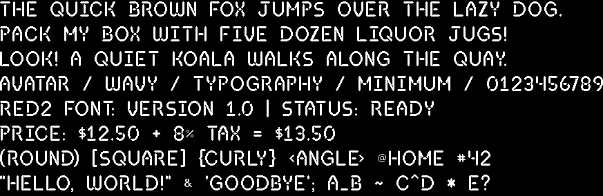

# Font

I felt like designing a font, so I did.



Render the sliced glyphs with Python and Aseprite:

```sh
python3 -m venv .venv
source .venv/bin/activate
pip install -r requirements.txt
python render_font.py "0123456789ABCD"
```

This runs `aseprite` from PATH, exports the first frame and slice metadata to
temporary files, maps slice userdata such as `c=65` to character code points,
and writes a black-background `output.png` in the current directory. It exports only
the `Glyphs` layer, excluding the Background guide lines. Transparent margins are
cropped horizontally; vertical slice metrics and blank space widths are preserved.
Use `--aseprite /path/to/aseprite`, `--source font.aseprite`, or
`--output preview.png` to override the defaults.

Every slice must have explicit `c=<decimal code point>` userdata, and all `c`
values must be unique. Rendering reports all validation errors before composing
the output.

Characters without a matching slice are skipped without adding spacing, with a
warning printed to the terminal for each distinct unrecognized character. Empty
text or text with no recognized characters produces a black 1×1 PNG.

Automatic kerning starts with the cropped glyph boxes `spacing` pixels apart
(default 4). It compares the facing edge pixels in each row against rows up to
`spacing` pixels above and below in the other glyph. The second glyph moves left
one pixel at a time until the closest Euclidean gap falls below the target,
then chooses that placement or the previous one, whichever is closer to the target.
Ties retain the wider placement. Actual gaps can be slightly below the target.
The threshold between pixel centers is `spacing + 1`, preserving the convention
that 3 means three empty pixels on a straight horizontal row. Blank glyphs and
pairs with no edges within the vertical radius keep their nominal advance.

Tightening also stops before the right glyph's right edge would move inside
the left glyph's right edge. The final pair advance is
`max(edge_gap_advance, left.width - right.width, 0)`. The right glyph's left edge
cannot come before the left glyph's left edge. Because horizontal transparent
margins are cropped, this means the advance must be nonnegative.
When the artwork permits it,
a narrow mark sits completely under the letter, flush with its right edge.
For example, periods tuck under P/F and an apostrophe tucks above L. Blank
glyphs retain nominal advances. This constraint can widen the nearest edge gap.

The left-edge constraint prevents a negative comma/4 advance from placing 4
before the second comma in `#,,4`. Equal left edges are allowed; actual occupied
pixels still respect the edge-gap rule.

Text layout takes the maximum required position across earlier glyphs:
`x = max(earlier_x + advance(earlier, next))`. In `P.O.`, O respects both P/O
and period/O spacing. In `L'.`, the apostrophe aligns with L's right edge and
the period keeps the same position as in `L.`. Repeated marks also respect each
other's pair advances, so they do not stack on the same pixels. This requires
only two-input pair lookups, without a three-input table or character-specific
exceptions.

The layout state is a queue of recent glyphs. An entry is discarded once
`earlier_x + earlier.width + spacing <= x`: no pair advance exceeds that nominal
bound, and future left edges cannot move backward. Both box edges stay in
reading order, so entries expire from the front of the queue. Only glyphs still
within reach require pair lookups; there is no map of character occurrences or
fixed two-glyph cutoff. For example, at spacing 3, `/,<T` still needs the `/`
constraint after the comma and `<`. State resets at line breaks. Pair previews
and CSV exports show independent pair advances; full strings combine their
constraints during layout.

With the default four-pixel gap, P is 14 pixels wide and the period is three.
The period therefore sits at x=11, ending flush with P at x=14. O's origin is
`max(0 + advance(P, O), 11 + advance(period, O)) = max(18, 16) = 18`, the same
position as in `PO`. Similarly, the apostrophe in `L'.` sits at x=11, while both
L/period and apostrophe/period require the period at x=18, matching `L.`.

```sh
python render_font.py --pairs --output kerning_pairs.png
python render_font.py "AVATAR" --spacing 2
python -m unittest test_render_font.py
```

`--pairs` renders every ordered pair of available glyphs, including digits,
punctuation, and spaces, ordered by code point. For N glyphs, it produces N² pairs
in N rows. Pair samples have a separate visual gap and do not require a space
slice. Text input also supports
newlines. `--spacing` controls the target gap and vertical search radius and `--layer` selects the artwork
layer. Advances are computed from the cropped widths and cached for repeated pairs.

`--spacing` accepts nonnegative integers. At `--spacing 0`, edge pixel centers
may be one pixel apart: glyphs can touch, but their pixels do not overlap.

`--pairs` also writes `kerning_pairs.csv` beside the PNG, omitting pairs whose
kerning adjustment is zero. The PNG still shows every pair. Columns contain the
left/right characters, requested spacing, advance, adjustment relative to cropped
width plus spacing, and the actual minimum pixel-center distance minus 1.
Distances are measured across all occupied pixels and rounded to six decimals.

CSV distances are blank for pairs containing an empty glyph such as space.

The example render test uses the real Aseprite font and writes `example.png` in
the project directory. Run it on its own with:

```sh
python -m unittest test_render_font.ExampleRenderTest
```

## Cropped glyphs and metadata

Consumers can import the existing loader directly. It requires Pillow and an
Aseprite executable, using the same environment as the renderer:

```python
from pathlib import Path
from render_font import load_glyphs, AutoKerning, horizontal_ink_metrics

# Run from this checkout, or supply an absolute source path.
glyphs = load_glyphs(Path("RED2 Font.aseprite"), "aseprite", layer="Glyphs")
kerning = AutoKerning(glyphs, spacing=4)

output = Path("glyphs")
output.mkdir(exist_ok=True)
for code, image in sorted(glyphs.items()):
    image.save(output / f"{code:03d}.png")
    print({
        "codepoint": code,
        "character": chr(code),
        "width": image.width,
        "height": image.height,
        "ink_bounds": image.getchannel("A").getbbox(),
        "horizontal_ink_metrics": horizontal_ink_metrics(image),
    })

left, right = ord("A"), ord("V")
advance = kerning.advance(left, right)
adjustment = advance - glyphs[left].width - kerning.spacing
print("A to V:", advance, "pixels; adjustment:", adjustment)
```

`load_glyphs` returns a dictionary mapping integer Unicode code points to
independent Pillow RGBA images. The PNGs preserve transparent pixels. A glyph
exists when its code point is in the dictionary; `glyphs.get(code)` returns
`None` for an unsupported character. The loader does not limit the font to ASCII.
Slice userdata is the character mapping: `c=65` means `A`, for example. Slice
names are not used to identify characters. Missing or duplicate mappings,
invalid Unicode scalars, and invalid frame-zero bounds are rejected.

The loader exports frame 0 of the selected artwork layer and uses each slice's
frame-zero bounds. Slices without a frame-zero key are not loaded. For a glyph
with ink, it removes only the fully transparent columns to the left and right.
It preserves the entire slice height, including transparent top and bottom rows.
An entirely transparent glyph keeps its original slice width and height, so
space still has a usable width. Pixel occupancy is determined by nonzero alpha,
not RGB color; `(0, 0)` is the cropped left edge and the original slice top.

The available metrics are:

| Metric | How to obtain it | Meaning |
| --- | --- | --- |
| Character code | Dictionary key | Explicit slice userdata code point |
| Cropped dimensions | `image.width`, `image.height` | Artwork extent, with vertical slice metrics preserved |
| Occupied bounds | `image.getchannel("A").getbbox()` | `(left, top, right, bottom)` with exclusive right/bottom; `None` for blank glyphs |
| Right ink edge and median | `horizontal_ink_metrics(image)` | `(exclusive_right_edge, upper_median_ink_x)`; `None` for blank glyphs |
| Pair advance | `kerning.advance(left, right)` | Right glyph's x origin relative to the left glyph's origin |
| Pair adjustment | Advance minus left width and spacing | Signed change from nominal placement; zero means no tightening |

The median is weighted by actual occupied pixels, not by occupied columns. It is
available for artwork inspection; kerning uses the right-edge rule above. Pair
order matters; compute both directions if needed. To obtain every pair, iterate over `sorted(glyphs)`
for both left and right and call `advance`. The existing `--pairs` command also
exports nonzero adjustments to the ordinary CSV described above.

Width is not a universal advance: pair advance depends on the next glyph and
chosen spacing, and a full string can impose additional earlier-glyph bounds.
Consumers can call `layout_line(codes, kerning)` with supported code points to
obtain `(codepoint, x)` placements matching the renderer. The renderer uses the
maximum glyph height plus four pixels for line advance. That is a layout
convention, not a baseline stored in the
source. The returned dictionary does not expose slice names, original sheet
coordinates, or removed horizontal margins. If those are needed, export and
retain the original Aseprite slice metadata separately:

```sh
aseprite -b --list-slices --layer Glyphs --frame-range 0,0 \
  "RED2 Font.aseprite" --sheet sheet.png --data slices.json
```

The original slice metadata is under `meta.slices` in `slices.json`; the `data`
field holds the character mapping and `keys` holds frame-specific bounds in
sheet coordinates. Keep the sheet untrimmed so those coordinates remain valid.
The Python loader uses temporary export files and returns the images after
those files have been removed. Downstream projects choose their own storage
and hardware layout from these images and metrics.
